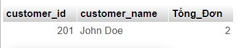

1. Lấy thông tin tất cả các sản phẩm đã được đặt trong một đơn đặt hàng cụ thể.

SELECT * FROM OrderDetails od JOIN Products p ON od.product_id = p.product_id WHERE od.order_id =301;

2. Tính tổng số tiền trong một đơn đặt hàng cụ thể.

SELECT SUM(p.price * od.quantity) AS Tính_Tổng FROM OrderDetails od JOIN Products p ON od.product_id = p.product_id WHERE od.order_id = 301;

3. Lấy danh sách các sản phẩm chưa có trong bất kỳ đơn đặt hàng nào.

SELECT p.product_name FROM Products p LEFT JOIN OrderDetails od ON p.product_id = od.product_id WHERE od.order_detail_id IS NULL;

4. Đếm số lượng sản phẩm trong mỗi danh mục. (category_name, total_products)

SELECT c.category_name, COUNT(p.product_id) AS Đếm_SốLượng FROM Categories c LEFT JOIN Products p ON c.category_id = p.category_id GROUP BY c.category_name;

5. Tính tổng số lượng sản phẩm đã đặt bởi mỗi khách hàng (customer_name, total_ordered)

SELECT cu.customer_name, COUNT(od.product_id) AS Tổng_SốĐơn FROM Customers cu LEFT JOIN Orders o ON cu.customer_id = o.customer_id LEFT JOIN OrderDetails od ON o.order_id = od.order_id GROUP BY cu.customer_name;

6. Lấy thông tin danh mục có nhiều sản phẩm nhất (category_name, product_count)

SELECT c.category_name, COUNT(p.product_id) AS Đếm_NhiềuSPN FROM Categories c LEFT JOIN Products p ON c.category_id = p.category_id GROUP BY c.category_name ORDER BY Đếm_NhiềuSPN DESC LIMIT 1;

7. Tính tổng số sản phẩm đã được đặt cho mỗi danh mục (category_name, total_ordered)

SELECT c.category_name, SUM(od.quantity) AS Tổng_SP FROM Categories c LEFT JOIN Products p ON c.category_id = p.category_id LEFT JOIN OrderDetails od ON p.product_id = od.product_id GROUP BY c.category_name;

8. Lấy thông tin về top 3 khách hàng có số lượng sản phẩm đặt hàng lớn nhất (customer_id, customer_name, total_ordered)

SELECT cu.customer_id, cu.customer_name, COUNT(od.product_id) AS Tổng_Ordermax FROM Customers cu LEFT JOIN Orders o ON cu.customer_id = o.customer_id LEFT JOIN OrderDetails od ON o.order_id = od.order_id GROUP BY cu.customer_id, cu.customer_name ORDER BY Tổng_Ordermax DESC LIMIT 3;

9. Lấy thông tin về khách hàng đã đặt hàng nhiều hơn một lần trong khoảng thời gian cụ thể (customer_id, customer_name, total_orders)

SELECT cu.customer_id, cu.customer_name, COUNT(DISTINCT o.order_id) AS Tổng_Đơn FROM Customers cu LEFT JOIN Orders o ON cu.customer_id = o.customer_id LEFT JOIN OrderDetails od ON o.order_id = od.order_id WHERE o.order_date BETWEEN '2023-08-01' AND '2023-08-04' GROUP BY cu.customer_id, cu.customer_name HAVING Tổng_Đơn > 1;

10. Lấy thông tin về các sản phẩm đã được đặt hàng nhiều lần nhất và số lượng đơn đặt hàng tương ứng (product_id, product_name, total_ordered)

SELECT p.product_id, p.product_name,p.price, p.quantity, COUNT(DISTINCT od.order_id) AS Tổng_ĐơnĐãĐặt FROM Products p LEFT JOIN OrderDetails od ON p.product_id = od.product_id GROUP BY p.product_id, p.product_name ORDER BY Tổng_ĐơnĐãĐặt DESC LIMIT 1;

